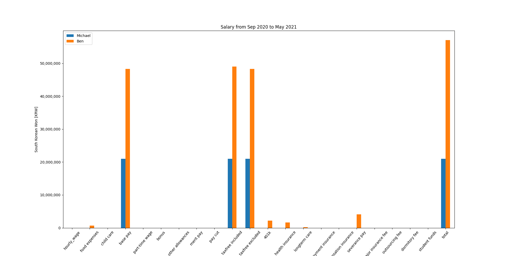

# Internship_ENJ
The code was developed to automate employees salary visualization.

ENJ company saves the employees' salary data, as shown below. 

  

The problem was it took so much time to figure out how much each employee gets paid monthly/quarterly/yearly and whether the employee gets paid fairly. The company did this task manually and then plotted the graph. 
This code was developed to automate the ENJ employees' aggregated salary to solve this problem. Once the starting/ending year, month, and name are provided as arguments in the code, it visualizes aggregated salaries in a bar graph and works hour table.

The code execution process is comprised of 2 steps. Firstly, the CSV data files are converted into JSON format because JSON has a lot of scalability in terms of adding and editing the content compared to CSV. The snippet of the JSON file is shown below (Because of personal data privacy, the original CSV data and entire JSON instance can't be posted on this repository.)

  

Second, the aggregated employees salary is plotted. The below figures show two examples out of the code. The first example comapres two employees salary from Sep 2020 to May 2021 and The second example compares three employees salary from Dec 2020 to Aug 2021.

  

  

